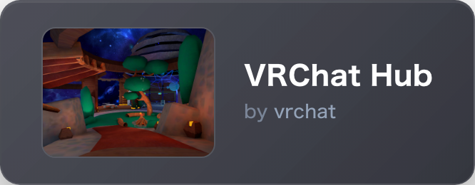
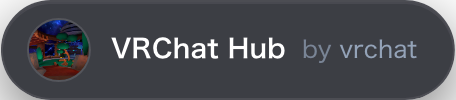

# vrc-world-credit-streaming-overlay

[English](./README.md) | 日本語

VRChat 配信時に、訪問中ワールドのクレジット（ワールド名・作者名・サムネイル等）を OBS にオーバーレイ表示するツール。

> **非公式ツール** — 本プロジェクトは VRChat Inc. による公式プロダクトではなく、関連・提携・承認のいずれの関係も持たない非公式な個人プロジェクトである。"VRChat" は VRChat Inc. の商標であり、本リポジトリは識別目的でのみその名称を参照する。利用者は VRChat の [Terms of Service](https://hello.vrchat.com/legal) および [Creator Guidelines](https://hello.vrchat.com/creator-guidelines) を遵守すること。

## 特徴

- **VRChat にログインしません** — アカウントのメールアドレス・パスワード・2FA コードを一切要求しません。あなたの認証情報がこのツールを通ることはありません。
- **VRChat 公式 API ガイドラインに準拠** — [Creator Guidelines](https://hello.vrchat.com/creator-guidelines#api-usage) の API 利用ルールに沿った設計（詳細は下記）。
- **VRCX などの外部ツールに依存しません** — このツール単体で動作します。VRChat が出力するログファイルを直接読みます。

## ガイドライン準拠

VRChat [Creator Guidelines](https://hello.vrchat.com/creator-guidelines#api-usage) の API 利用ルールに対して、以下のように準拠している。

- **認証情報を要求しない** — ログイン UI・トークン保存・セッションデータ取得のいずれも持たない。
- **User-Agent 適正表記** — `appName/version contact` 形式で VRChat の指定どおり名乗る（`VRCHAT_API_CONTACT` で連絡先を必須化）。
- **429 を受けたら叩き続けない** — レート制限を一度でも踏んだ瞬間にアプリを内部ロックし、再起動するまで以降 API を一切呼ばない。
- **固定間隔の API 連打をしない** — ワールド移動を検知した瞬間にだけ単発で呼ぶイベント駆動。秒/分単位のクロックでポーリングしない。
- **適切なキャッシュ** — 同一ワールドへの再訪はメモリキャッシュから返し、API への重複問い合わせを回避する。
- **アップロード代理・インパーソネートなし** — 自分以外のアカウントで何かを実行する機能を持たない。アバター・ワールドのアップロード機能も持たない。
- **公開ワールド情報のみ取得** — 認証無しで取得できる `GET /api/1/worlds/{id}` のみを叩く。プライベート・フレンド情報には一切アクセスしない。

## 使い方

VRChat と同じ Windows PC で動かす想定。

1. [Bun](https://bun.sh) をインストールする。
2. このリポジトリを clone する。
3. 依存をインストールしてクライアントをビルドする:

   ```powershell
   bun install
   bun run build
   ```

4. `start.cmd.example` を `start.cmd` にコピーし、`VRCHAT_API_CONTACT` を自分の連絡先メールアドレスに書き換える。VRChat [Creator Guidelines](https://hello.vrchat.com/creator-guidelines#api-usage) により、API 利用時は User-Agent に連絡先を含めることが必須。
5. `start.cmd` をダブルクリックして起動する。
6. 配信ソフトでブラウザソースを追加し、URL に `?style=` パラメータを付けて開く:

   ```
   http://localhost:3000/?style=card
   ```

## スタイル

ブラウザソース URL の `?style=<name>` で見た目を切り替える。未指定時は CSS 無しの素の HTML。

### `?style=card` — 大きめのクレジットカード



### `?style=topbar` — 画面上部中央の通知風ピル



さらに調整したい場合は OBS の Custom CSS 欄で個別ルールを上書きする。詳細は次節参照。

## カスタム CSS

OBS のブラウザソース「カスタム CSS」欄に書き込めば、同梱スタイルの上に好きなルールを重ねられる（後勝ち）。素の HTML から自分で全部書きたいときは `?style=` を付けずに開けばよい。

### DOM 構造

オーバーレイは以下の固定された ID／クラスで構成されている。これらをセレクタに使う。実物のマークアップは [`src/client/index.html`](./src/client/index.html) を参照。

```html
<div id="overlay">
                <!-- ワールドサムネイル。imageUrl 不在時は hidden 属性が付く -->
  <div id="meta">
    <div id="world-name">…</div>  <!-- ワールド名 -->
    <div id="author-name">
      <span class="by">by </span> <!-- "by " 接頭辞だけ薄くしたいときに使える -->
      …                           <!-- 作者名（テキストノード） -->
    </div>
  </div>
</div>
```

同梱スタイルそのものを上書き元として読みたい場合は [`styles/card.css`](./styles/card.css) / [`styles/topbar.css`](./styles/topbar.css) を参照。

### OBS カスタム CSS の例

```css
/* 文字色とフォントを変える */
#world-name { color: #ffd86b; font-family: "Noto Serif JP", serif; }
#author-name { color: #c8b39a; }

/* サムネイルを丸く小さく */
#thumb { width: 64px; height: 64px; border-radius: 50%; }

/* オーバーレイの位置を画面右下に固定する */
#overlay {
  position: fixed;
  inset: auto 24px 24px auto;  /* top auto / right 24px / bottom 24px / left auto */
}

/* 入場アニメーションを止める */
#overlay { animation: none; }

/* "by " の前置詞を非表示にする */
#author-name .by { display: none; }
```

> 同梱スタイルが指定しているプロパティを上書きしたいときは、より詳細度の高いセレクタにするか `!important` を付ける。

## 環境変数

`start.cmd` で設定する。

- `VRCHAT_API_CONTACT` (必須) — VRChat API の User-Agent に含める連絡先メールアドレス。Creator Guidelines により必須。
- `PORT` — サーバのポート番号（既定 `3000`）。
- `VRCHAT_LOG_DIR` — VRChat ログディレクトリ（既定 `%USERPROFILE%\AppData\LocalLow\VRChat\VRChat`）。別の場所を参照させたいときだけ指定する。
- `VRCHAT_LOG_POLL_INTERVAL_MS` — ログのポーリング間隔（ミリ秒、既定 `2000`）。

---

## 技術スタック

- ランタイム: Bun
- 言語: TypeScript
- サーバ: Hono
- 通信: Server-Sent Events (SSE)

## ディレクトリ構成

```
src/
  schema.ts            サーバ／クライアント共有のスキーマ・定数
  server/              サーバ実装
    index.ts           Hono アプリ
    sse.ts             SSE ブロードキャスタ
    vrchat-api.ts      VRChat API クライアント
    log-watcher.ts     VRChat ログ監視
  client/              ブラウザソース用 UI
    index.html
    main.ts
styles/                同梱スタイル（?style=<name> で切替）
  card.css
  topbar.css
dist/client/           ビルド出力（gitignore）
```

## 開発

```bash
bun install
VRCHAT_API_CONTACT=<your-email> bun run dev
```

`bun run dev` はクライアントのビルド監視とサーバ起動を同時に走らせる。

ログを介さず手動でワールド情報を流して表示確認するには:

```bash
curl -X POST http://localhost:3000/api/dev/set-world/<world_id>
```

## ライセンス

[MIT License](./LICENSE) + Additional Condition（VRChat Policy Compliance）。

ベースは MIT のため、使用・複製・改変・再配布・販売を自由に許可する。ただし追加条件として、**VRChat の Terms of Service および Creator Guidelines（[hello.vrchat.com](https://hello.vrchat.com)）に準拠する範囲でのみ** 利用できる。VRChat の規約に違反した時点で、本ライセンスにより付与された権利は自動的に消滅する。

このツールは VRChat エコシステムの上に成り立つものであり、許される範囲は VRChat 自身が定めるべきという立場による。追加条件は VRChat の規約に独自制限を上乗せしない。逆に、VRChat の規約より緩く使うことも許可しない。
